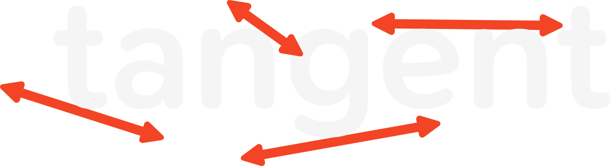

<p align="center">
  
</p>
Meet tangent, a Linux-based 3D modeling software built for the ergonomics of Blender with the precision of Fusion360. Built for 3D printing purposes, this mesh-based modeling tool natively exports to .stl and rejects invalid operations immediately. It's fast, accurate, and just works. Tangent is C++ on OpenGL 3.3, targeting Linux/Wayland, and has no runtime
dependencies beyond the system GL stack.<br><br>

**Status:** early development, not ready for use

## Build

Requires a C++20 compiler, CMake ≥ 3.24, SDL3 and libepoxy

```sh
cmake -S . -B build -G Ninja
cmake --build build
./build/tangent
```

Run the tests:

```sh
ctest --test-dir build --output-on-failure
```

## Features

### Mesh-based
Similar to Blender, tangent is **mesh-based**. Meshes are the native object of `.stl` files, and therefore tangent supports importing and exporting for 3D printing natively without conversion. This is a large pain point with Fusion360, which is B-rep based and requires conversion when handling meshes.<br>
Unlike Blender, tangent rejects non-manifold edges, open surfaces, and other invalid operations that would also be rejected by 3D printing slicers. The status bar will indicate `solid` or `not solid` if an existing mesh doesn't comply with these rules.

### Conventions

- **Millimetres**, **+Z up**
- New objects are placed **on the build plate** (z = 0), not centred through it
- The grid subdivides by powers of ten as you zoom, down to 0.1 mm.
- **Snapping is on by default**, and Ctrl releases it. A part is designed in
  round numbers; free positioning is the exception. The increment is relative
  to the viewport zoom such that you can make more precise edits when zoomed closer. It is shown in
  the status bar while you drag.
- **An edit either produces valid geometry or it does not happen.** A drag that
  would make the model self-intersect is refused and reverted.
- Numeric entry is always available during any transform.

### Default Controls

| Input | Action |
|-------|--------|
| MMB drag | Orbit |
| Shift + MMB | Pan |
| Wheel | Zoom |
| Click | Select the edge, face or vertex under the cursor |
| Ctrl + click | Select the whole object (as clicking its outliner row) |
| Shift + click | Extend either selection |
| E | Extrude selected faces, then drag to set the height |
| Ctrl + B | Bevel all edges of the active object |
| Ctrl + Shift + U / D / I | Union / difference / intersect the two selected objects |
| D | Measure — one entity for its own size, two for the distance between |
| Numpad 1 / 3 / 7 | Front / Right / Top (Ctrl for opposite) |
| Numpad 4 / 6 / 8 / 2 | Orbit in 15° steps |
| Numpad 5 | Perspective / orthographic |
| Numpad . / Home | Frame selection / frame all |
| G / R / S | Move / rotate / scale — the object, or the selected faces/edges/vertices |
| X / Y / Z | *(during a transform)* constrain to an axis |
| Shift + X/Y/Z | *(during a transform)* constrain to a plane |
| type a number | *(during a transform)* exact value |
| Ctrl | *(during a transform)* release the snap for free positioning |
| Enter or click | Confirm transform |
| Esc or right click | Cancel transform |
| Ctrl + Z / Ctrl + Shift + Z | Undo / redo |
| Shift + A | Add object |
| A / Alt + A | Select all / deselect all |
| Shift + D | Duplicate |
| X or Delete | Delete |
| Z | Toggle wireframe |
| Ctrl + Q | Quit |

## Project Structure

```
src/core/     math and colour palette (header only)
src/mesh/     half-edge kernel, primitives, operations, printability checks
src/scene/    scene graph, feature history, selection, ray picking
src/render/   shader and buffer wrappers, viewport renderer
src/app/      SDL3 shell, orbit camera, input dispatch, transform tool, undo
src/ui/       theme and panels
shaders/      GLSL 330, hot-reloaded
tests/        headless kernel and scene tests
```

## Licence
GPL-3.0